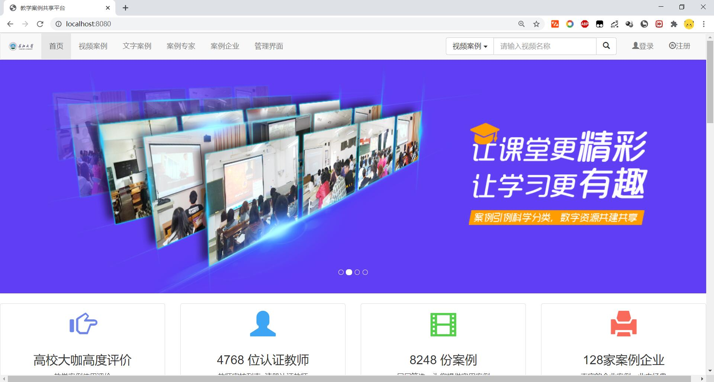

## teach case share website

### screen shot

### teach stack
- springboot
    - spring-boot-starter-data-jpa(code first)
    - spring-boot-starter-thymeleaf(front template)
- javax.mail(active account)
- bootstrap(front)

### cloud
- qiniu-java-sdk

### problem during development
#### 9:44 2020/8/20
- Q:Compent & Service
    - A:
- Q:Autowired & Resource
    - A:
#### 10:52 2020/8/20
- Q:Model&ModelAndView
    - A:
- Q:RedirectAttributes&ModelAttribute 
    - A:

 
11:04 2020/8/21

- git reflog
- git checkout e0aa54a
- git status
 - HEAD detached at e0aa54a
- git checkout -b temp
- git checkout master
- git merge temp
- git branch -D temp

### thanks
- [spring-boot-examples](https://github.com/ityouknow/spring-boot-examples)
- [china_school_badge](https://github.com/lovefc/china_school_badge)
- stackoverflow & other teach forum